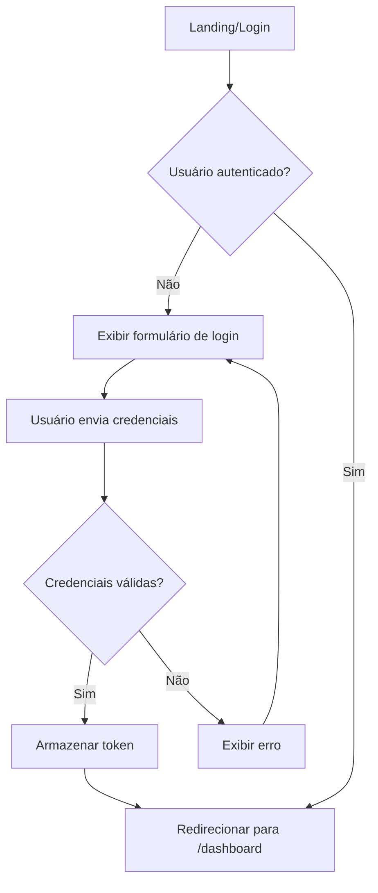

# Mapa de Rotas e Fluxos - Hábitos

## 📍 Rotas da Aplicação

### Públicas (Não autenticadas)

| Rota | Componente | Descrição |
|------|-----------|-----------|
| `/login` | `LoginPage` | Página de login |
| `/register` | `RegisterPage` | Criação de nova conta (opcional) |
| `/forgot-password` | `ForgotPasswordPage` | Recuperação de senha (opcional) |

### Protegidas (Requer autenticação)

| Rota | Componente | Descrição |
|------|-----------|-----------|
| `/` | `Dashboard` | Página inicial, redireciona para `/dashboard` |
| `/dashboard` | `Dashboard` | Dashboard principal com resumo |
| `/habits` | `HabitsPage` | Lista de todos os hábitos |
| `/habits/new` | `CreateHabit` | Formulário de novo hábito |
| `/habits/:id/edit` | `CreateHabit` | Edição de hábito existente (reutiliza componente) |
| `/habits/:id` | `HabitDetail` | Visualização detalhada com calendário |
| `/reports` | `Reports` | Relatórios e gráficos |
| `/settings` | `Settings` | Configurações da conta |

### Auxiliares

| Rota | Componente | Descrição |
|------|-----------|-----------|
| `/error` | `ErrorPage` | Página de erro genérica |
| `*` | `NotFound` | 404 - Página não encontrada |

---

## 🔄 Fluxos de Navegação

### 1. Fluxo de Autenticação



**Código:**
```jsx
// LoginPage.jsx
const handleLogin = async (e) => {
  e.preventDefault();
  setLoading(true);
  setError('');

  const result = await login(email, password);
  
  if (result.success) {
    navigate('/dashboard');
  } else {
    setError(result.error || 'Erro ao fazer login');
  }
  
  setLoading(false);
};
```

---

### 2. Fluxo de Criação de Hábito

```
Dashboard → Botão "Novo Hábito" → /habits/new → Preencher formulário → Salvar → 
  → Toast de sucesso → Redirecionar para /habits
```

**Páginas envolvidas:**
- **Dashboard:** CTA "Novo Hábito"
- **CreateHabit:** Formulário com campos:
  - Nome (obrigatório)
  - Frequência: Diário/Semanal (obrigatório)
  - Meta (opcional)
  - Lembretes (opcional)
- **HabitsPage:** Lista atualizada com novo hábito

**Código:**
```jsx
// CreateHabit.jsx
const handleSubmit = async (e) => {
  e.preventDefault();
  
  const habitData = {
    name,
    frequency,
    goal,
  };

  try {
    await createHabit(habitData);
    showToast('Hábito criado com sucesso!', 'success');
    navigate('/habits');
  } catch (error) {
    showToast('Erro ao criar hábito', 'error');
  }
};
```

---

### 3. Fluxo de Edição de Hábito

```
HabitsPage → Botão "Editar" → /habits/:id/edit → Formulário pré-preenchido → 
  → Salvar → Toast → Voltar para /habits
```

**Componente reutilizado:** `CreateHabit`

**Diferença:** Se `useParams().id` existe, buscar dados do hábito e preencher formulário.

```jsx
// CreateHabit.jsx
const { id } = useParams();
const isEditing = Boolean(id);

useEffect(() => {
  if (isEditing) {
    // Buscar dados do hábito
    fetchHabit(id).then(data => {
      setName(data.name);
      setFrequency(data.frequency);
      setGoal(data.goal);
    });
  }
}, [id]);

const handleSubmit = async (e) => {
  e.preventDefault();
  
  if (isEditing) {
    await updateHabit(id, habitData);
    showToast('Hábito atualizado!', 'success');
  } else {
    await createHabit(habitData);
    showToast('Hábito criado!', 'success');
  }
  
  navigate('/habits');
};
```

---

### 4. Fluxo de Conclusão de Hábito

```
Dashboard/HabitsPage → Botão "Marcar como concluído" → 
  → POST /api/habits/:id/complete → Atualizar UI → Toast de sucesso
```

**Não há navegação,** apenas atualização do estado.

```jsx
// HabitCard.jsx
const handleToggleComplete = async () => {
  try {
    await completeHabit(habit.id);
    showToast('Hábito concluído! 🎉', 'success');
    // Atualizar lista local ou refetch
  } catch (error) {
    showToast('Erro ao marcar hábito', 'error');
  }
};
```

---

### 5. Fluxo de Visualização de Detalhes

```
HabitsPage → Clicar no card do hábito → /habits/:id → 
  → Visualizar calendário, histórico e estatísticas
```

**HabitDetail** exibe:
- Nome e frequência
- Calendário interativo (marcar dias passados)
- Gráfico de progresso
- Estatísticas (streak atual, total de conclusões, taxa de sucesso)

```jsx
// HabitDetail.jsx
const { id } = useParams();
const { data: habit } = useHabit(id);
const { data: history } = useHabitHistory(id);

return (
  <div>
    <h1>{habit.name}</h1>
    <Calendar history={history} onToggleDate={handleToggleDate} />
    <Stats habit={habit} />
  </div>
);
```

---

### 6. Fluxo de Relatórios

```
Dashboard/NavBar → Link "Relatórios" → /reports → 
  → Selecionar período → Visualizar gráficos → Export CSV (opcional)
```

**Reports** exibe:
- Filtros: Última semana, mês, ano, customizado
- Gráfico de barras: conclusões por dia/semana
- Gráfico de linha: tendência de progresso
- Tabela de resumo
- Botão "Exportar CSV"

```jsx
// Reports.jsx
const [period, setPeriod] = useState('week');
const { data: reportData } = useReportData(period);

return (
  <div>
    <Select 
      value={period}
      onChange={(e) => setPeriod(e.target.value)}
      options={[
        { value: 'week', label: 'Última semana' },
        { value: 'month', label: 'Último mês' },
        { value: 'year', label: 'Último ano' }
      ]}
    />
    <BarChart data={reportData} />
    <Button onClick={handleExportCSV}>Exportar CSV</Button>
  </div>
);
```

---

### 7. Fluxo de Logout

```
Qualquer página autenticada → Botão "Sair" (NavBar) → 
  → Confirmar (opcional) → Limpar token → Redirecionar para /login
```

```jsx
// NavBar.jsx
const { logout } = useAuth();
const navigate = useNavigate();

const handleLogout = () => {
  logout();
  navigate('/login');
};
```

---

## 🗺️ Mapa Visual da Aplicação

```
┌─────────────────┐
│   /login        │ (público)
└────────┬────────┘
         │ autenticar
         ▼
┌─────────────────────────────────┐
│      /dashboard (Home)          │
│  • Stats cards                  │
│  • Lista resumida de hábitos    │
│  • CTA "Novo hábito"            │
└─────────┬───────────────────────┘
          │
    ┌─────┼─────┬─────────┐
    ▼     ▼     ▼         ▼
┌────────┐ ┌────────┐ ┌────────┐ ┌────────┐
│/habits │ │/reports│ │/settings│ │/habits/│
│        │ │        │ │         │ │  new   │
│Lista   │ │Gráficos│ │Perfil   │ │Criar   │
│completa│ │Export  │ │Logout   │ │        │
└────┬───┘ └────────┘ └─────────┘ └────┬───┘
     │                                  │
     ▼                                  │
┌──────────┐                           │
│/habits/:id│◄──────────────────────────┘
│Detalhes  │
│Calendário│
└──────────┘
     │
     ▼
┌─────────────┐
│/habits/:id/ │
│    edit     │
│Editar       │
└─────────────┘
```

---

## 📋 Componentes por Página

### Dashboard
```jsx
<Dashboard>
  <NavBar user={user} onLogout={handleLogout} />
  <Container>
    <DashboardHeader title="Olá, Usuário!" />
    <StatsGrid>
      <StatCard label="Hábitos ativos" value={8} icon={<ChartIcon />} />
      <StatCard label="Streak" value={23} icon={<FireIcon />} />
      <StatCard label="Concluídos hoje" value="5/8" icon={<CheckIcon />} />
    </StatsGrid>
    <Section>
      <SectionHeader title="Seus hábitos" action={<Button>Novo</Button>} />
      <HabitsGrid>
        {habits.map(habit => (
          <HabitCard 
            key={habit.id}
            habit={habit}
            onEdit={handleEdit}
            onDelete={handleDelete}
            onToggleComplete={handleToggle}
          />
        ))}
      </HabitsGrid>
    </Section>
  </Container>
</Dashboard>
```

### HabitsPage
```jsx
<HabitsPage>
  <NavBar />
  <Container>
    <PageHeader title="Meus Hábitos" />
    <Filters>
      <Select options={['Todos', 'Ativos', 'Arquivados']} />
      <Input placeholder="Buscar..." icon={<SearchIcon />} />
    </Filters>
    {habits.length === 0 ? (
      <EmptyState 
        icon={<CalendarIcon />}
        title="Nenhum hábito ainda"
        description="Comece criando seu primeiro hábito"
        action={<Button>Criar hábito</Button>}
      />
    ) : (
      <HabitsGrid>
        {habits.map(habit => <HabitCard {...} />)}
      </HabitsGrid>
    )}
  </Container>
</HabitsPage>
```

### CreateHabit
```jsx
<CreateHabit>
  <NavBar />
  <Container>
    <PageHeader title={isEditing ? 'Editar Hábito' : 'Novo Hábito'} />
    <Card>
      <form onSubmit={handleSubmit}>
        <Input 
          label="Nome do hábito"
          value={name}
          onChange={setName}
          required
        />
        <Select 
          label="Frequência"
          value={frequency}
          onChange={setFrequency}
          options={[
            { value: 'daily', label: 'Diário' },
            { value: 'weekly', label: 'Semanal' }
          ]}
        />
        <Input 
          label="Meta (opcional)"
          type="number"
          value={goal}
          onChange={setGoal}
        />
        <Button type="submit" loading={loading}>
          {isEditing ? 'Salvar' : 'Criar hábito'}
        </Button>
      </form>
    </Card>
  </Container>
</CreateHabit>
```

---

## 🔐 Guards e Redirecionamentos

### ProtectedRoute

```jsx
const ProtectedRoute = ({ children }) => {
  const { user, loading } = useAuth();
  const location = useLocation();
  
  if (loading) {
    return <LoadingSpinner />;
  }
  
  if (!user) {
    // Salvar URL desejada para redirecionar depois
    return <Navigate to="/login" state={{ from: location }} replace />;
  }
  
  return children;
};
```

### Redirect após Login

```jsx
// LoginPage.jsx
const location = useLocation();
const from = location.state?.from?.pathname || '/dashboard';

const handleLogin = async (e) => {
  e.preventDefault();
  const result = await login(email, password);
  
  if (result.success) {
    navigate(from, { replace: true });
  }
};
```

---

## 🎯 Prioridades de Implementação

### Fase 1 - MVP (Essencial)
1. ✅ Login (/login)
2. ✅ Dashboard (/dashboard)
3. ✅ Lista de hábitos (/habits)
4. ✅ Criar hábito (/habits/new)
5. ✅ Marcar como concluído (inline)

### Fase 2 - Core Features
6. Editar hábito (/habits/:id/edit)
7. Detalhes do hábito (/habits/:id)
8. Relatórios básicos (/reports)

### Fase 3 - Polimento
9. Settings (/settings)
10. Onboarding (tooltip tour)
11. Recuperação de senha
12. Export CSV

---

## 📱 Considerações Mobile

### Navegação Mobile

- **Hamburger menu** para links principais
- **Bottom tab bar** (opcional) para Dashboard, Habits, Reports
- **Swipe gestures** para deletar hábitos (opcional)
- **Pull-to-refresh** nas listas

### Ajustes de Layout

```css
@media (max-width: 640px) {
  /* Ocultar NavBar links, mostrar menu */
  .navbar-nav { display: none; }
  .navbar-menu-toggle { display: flex; }
  
  /* Grid de 1 coluna */
  .habits-grid { grid-template-columns: 1fr; }
  
  /* Padding reduzido */
  .container { padding: var(--spacing-3); }
}
```

---

**Ver também:**
- `STYLE_GUIDE.md` - Design system completo
- `IMPLEMENTATION_NOTES.md` - Detalhes técnicos de implementação
